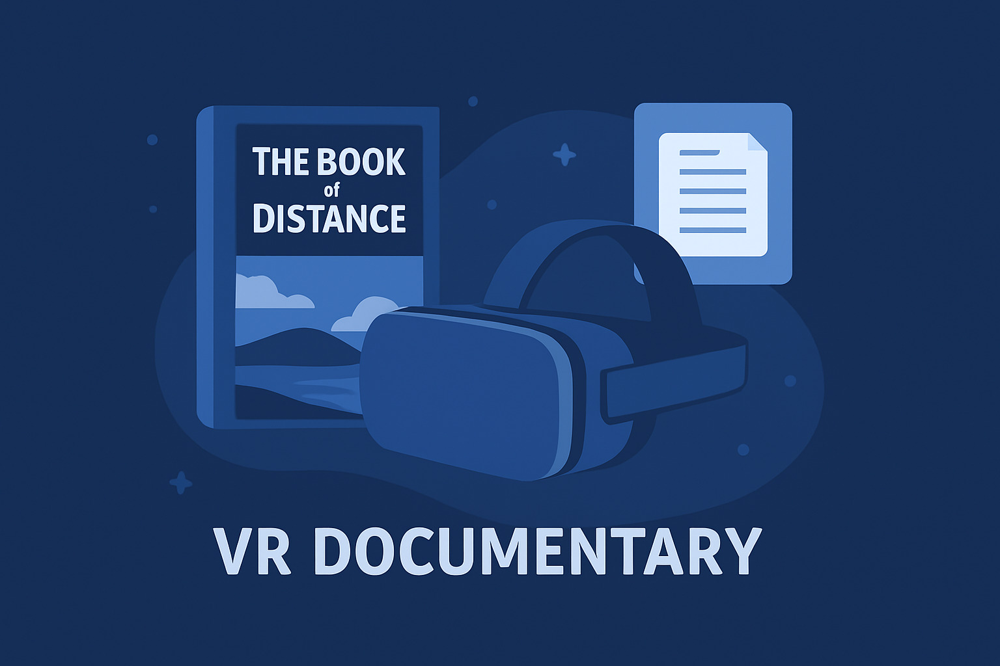

# PEC3 · Manovich Reloaded  
## Las gafas de Manovich en la cultura digital contemporánea

**Autor:** Jesús Lebrón  
**Asignatura:** Cultura Digital  
**PEC:** 3  
**Repositorio:** PEC3_Manovich_Reloaded  
**Licencia:** Creative Commons BY-NC 4.0  

---

## Introducción  
### ¿Qué es la hibridación de medios?

En *El software toma el mando*, Lev Manovich explica cómo el software ha pasado de ser una
herramienta invisible a convertirse en el elemento central que organiza la cultura
digital. En este contexto aparece el concepto de **hibridación de medios**, que describe
cómo distintos medios dejan de funcionar por separado y se integran dentro de una misma
lógica computacional.

A diferencia de la multimedia clásica, donde texto, imagen o vídeo simplemente se colocan
uno junto a otro, la hibridación implica una transformación más profunda: los medios se
reinterpretan como **datos, algoritmos e interfaces** gestionados por software.

> *“La hibridación no consiste en mezclar medios, sino en generar nuevas formas de medios a
partir del software”*  
> — Lev Manovich, *El software toma el mando*

En este trabajo analizo dos casos actuales que considero buenos ejemplos de este
fenómeno y que podrían encajar perfectamente en una segunda edición del libro de
Manovich.

---

## ¿Cómo reconocer una hibridación de medios?

Para Manovich, una hibridación se puede identificar cuando no estamos solo ante una suma
de medios, sino ante un **nuevo sistema**. Algunas pistas claras son:

- Los medios ya no funcionan de forma independiente  
- El software define cómo se representa y se experimenta el contenido  
- Aparecen nuevas formas de interacción  
- La experiencia no es fija, sino variable y personalizable  

Estos criterios sirven como base para el análisis de los dos casos seleccionados.

---

## Caso 1 · *Mona Lisa: Beyond the Glass*  
### Realidad aumentada como evolución del medio museístico

*Mona Lisa: Beyond the Glass* es una experiencia de realidad aumentada desarrollada por el
Museo del Louvre junto a HTC Vive Arts. A través de esta propuesta, el museo ofrece una
nueva forma de acercarse a una obra clásica mediante tecnologías inmersivas.

### ¿Es hibridación o multimedia?

No se trata de un caso de multimedia tradicional. La pintura no se acompaña simplemente
de textos o vídeos explicativos, sino que es **digitalizada y reinterpretada** como un
conjunto de datos computacionales que generan nuevas visualizaciones imposibles en el
medio original.

### ¿Evolución del medio o remezcla?

Este proyecto puede entenderse como una **evolución del medio museístico**. La obra no se
remezcla con otros medios de forma superficial, sino que se transforma en una experiencia
híbrida que da lugar a un nuevo lenguaje expositivo.

### ¿Dónde se produce la hibridación?

**En los datos:**  
La obra es escaneada en alta resolución y convertida en modelos 3D, capas pictóricas y
animaciones. Este proceso responde a lo que Manovich denomina **transcoding cultural**.

**En la interfaz:**  
La realidad aumentada convierte el espacio físico del museo en una superficie
interactiva, permitiendo que el visitante experimente simultáneamente la obra real y sus
capas digitales.

### Estrategias de hibridación (Manovich)

- Fusión de técnicas de distintos medios  
- Remixabilidad profunda  
- Variabilidad de la experiencia del usuario  
- Automatización de la representación  

### Valoración personal

Este caso me parece especialmente interesante porque demuestra que el museo no solo usa
tecnología para explicar mejor una obra, sino que **redefine la propia experiencia de
visitarlo**. Desde las gafas de Manovich, el museo se convierte en una **plataforma de
medios híbrida**, donde lo físico y lo digital se integran de forma natural.

---

## Caso 2 · *The Book of Distance*  
### Documental inmersivo y nueva narrativa espacial

*The Book of Distance* (2020), dirigido por Randall Okita y producido por el National Film
Board of Canada, es un documental inmersivo en realidad virtual que reconstruye una
historia real relacionada con la internación de ciudadanos japoneses-canadienses durante
la Segunda Guerra Mundial.

### ¿Es hibridación o multimedia?

Aunque la obra integra audio, texto y reconstrucción visual, no puede considerarse un
simple caso de multimedia. El relato se construye como un **entorno tridimensional
navegable**, donde el usuario deja de ser un espectador pasivo.

### ¿Nuevo lenguaje y nueva plataforma?

La obra propone un **nuevo lenguaje narrativo híbrido** entre documental, videojuego y
simulación. En este sentido, la realidad virtual actúa como una **nueva plataforma de
medios**, con reglas propias de representación e interacción.

### ¿Dónde se produce la hibridación?

**En los datos:**  
Testimonios, documentos históricos y archivos se transforman en datos que permiten crear
escenarios y situaciones espaciales.

**En la interfaz:**  
La interfaz de realidad virtual elimina la distancia entre espectador y relato, generando
una experiencia basada en la presencia y el movimiento.

### Estrategias de hibridación

- Narrativa espacial  
- Integración de técnicas propias del videojuego  
- Automatización de la puesta en escena  
- Variabilidad del recorrido narrativo  

### Valoración personal

Este caso me parece un buen ejemplo de cómo el documental y el periodismo están
evolucionando gracias al software. La realidad virtual no se utiliza como un simple efecto
visual, sino como una forma distinta de contar una historia real, más cercana y
participativa.

---

## Conclusión

Los dos casos analizados muestran que la hibridación de medios es una característica
central de la cultura digital actual. Tanto en el ámbito artístico como en el
documental, el software actúa como un **metamedio** que reorganiza lenguajes culturales ya
existentes.

Como plantea Manovich, el software no solo sirve para representar contenidos, sino que
**define cómo los experimentamos**. Estos ejemplos confirman que entender los medios
contemporáneos implica comprender el papel central del software.

---

## Licencias

### Licencia general del trabajo

Este trabajo se distribuye bajo una licencia  
**Creative Commons Atribución–NoComercial 4.0 Internacional (CC BY-NC 4.0)**.

🔗 https://creativecommons.org/licenses/by-nc/4.0/

---

## Referencias

- Manovich, L. (2013). *El software toma el mando*.  
- Museo del Louvre – *Mona Lisa: Beyond the Glass*  
  https://www.louvre.fr/en/explore/life-at-the-museum/mona-lisa-beyond-the-glass-the-louvre-s-first-virtual-reality-experience
- National Film Board of Canada – *The Book of Distance*  
  https://collection.nfb.ca/interactive/the_book_of_distance

